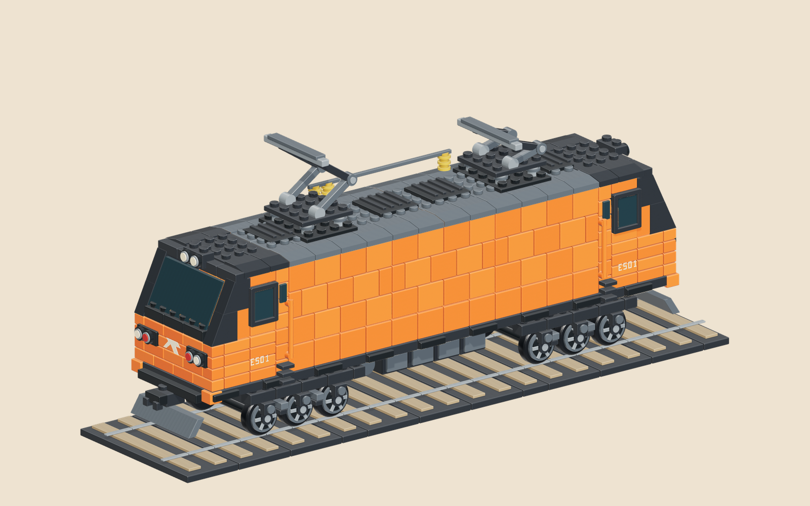
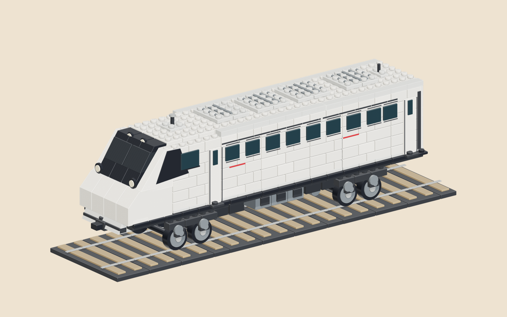
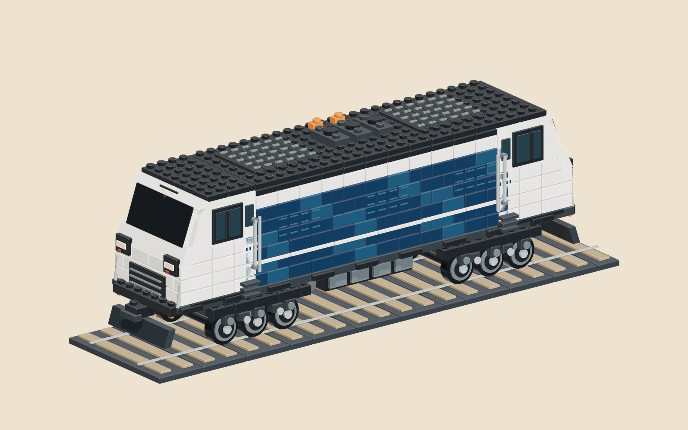
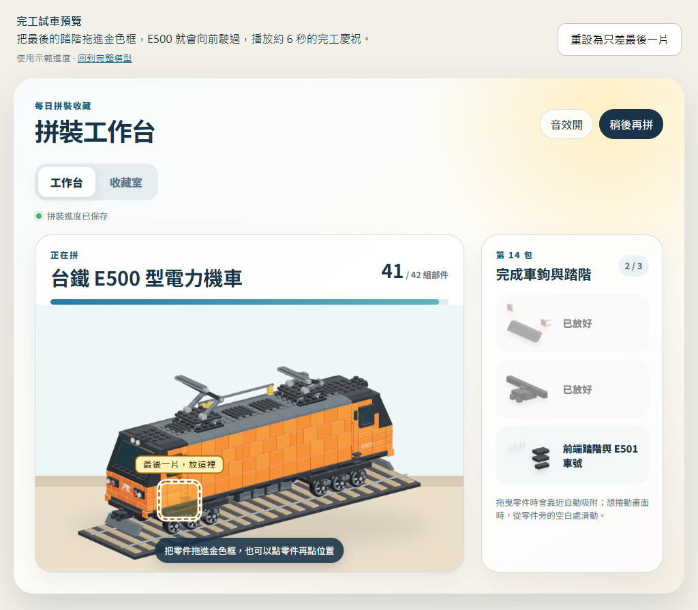
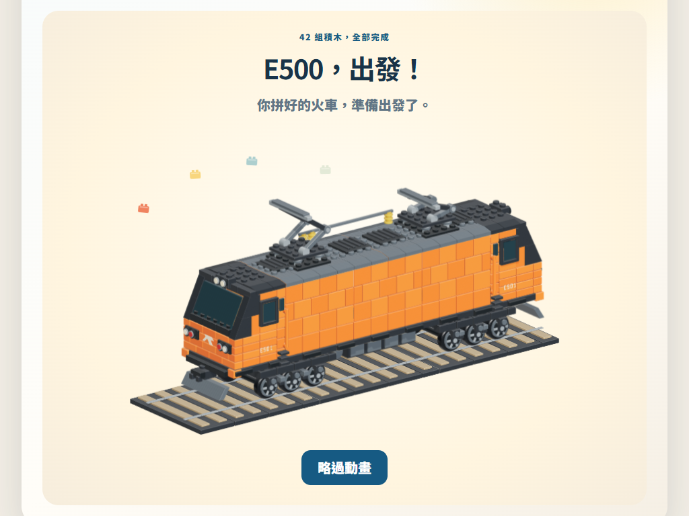
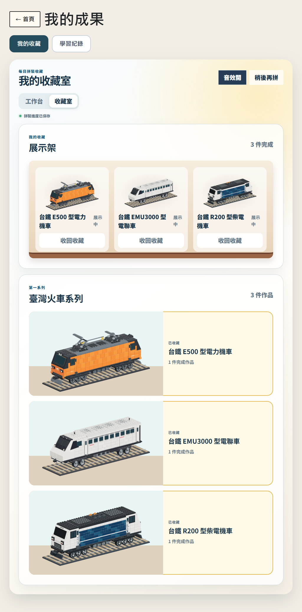
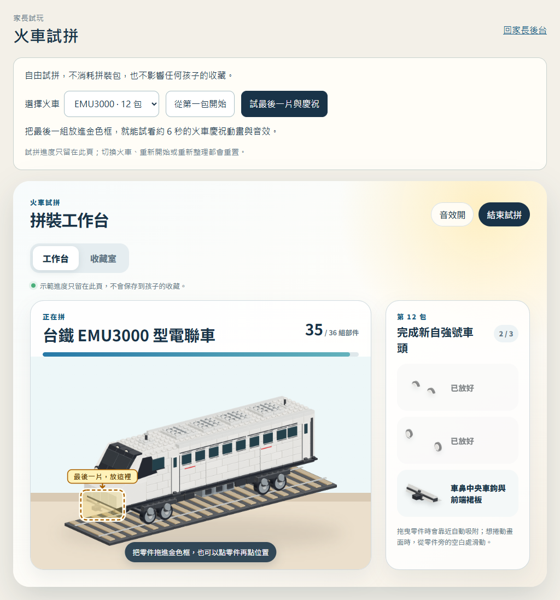

# 每日目標與拼裝收藏

主規格 [#110](https://github.com/huansbox/aiden-study/issues/110)，實作拆分為每日目標 [#111](https://github.com/huansbox/aiden-study/issues/111)、拼裝 [#112](https://github.com/huansbox/aiden-study/issues/112) 與整合驗收 [#113](https://github.com/huansbox/aiden-study/issues/113)。

目前狀態：2026-09-23 已透過 [PR #114](https://github.com/huansbox/aiden-study/pull/114) 合併並發布至[正式網站](https://kids.linshuhuan.com/)，主規格及三個實作 issues 已結案。下方各階段驗收紀錄保留當時狀態，最新發布結果見文末。

## 使用方式

家長後台的「孩子設定與練習 → 每日目標與拼裝包」提供「火車試拼」，開啟獨立的 [試拼頁](../docs/parent/train-preview.html)。五款車都能從第一包開始，逐包試到完工；也能直接保留最後一組，試拖曳、六秒慶祝、音效、略過、重播及示範展示架。從家長入口開啟後，返回時保留原本管理的孩子。

試拼頁只掛記憶體 adapter，沿用正式工作台與素材，不載入家庭登入、收藏 client 或同步程式，不讀寫家庭 API、localStorage／sessionStorage，也不消耗任何孩子的拼裝包。頁面的 `connect-src 'none'` 另阻擋 API 連線。切換模型、重新開始或重新整理會重置示範進度；離開／結束／重設會停止音效及動畫。入口 `docs/parent/train-preview.html`，行為在 `train-preview.js`；共用工作台的 `preview` 選項只調整試拼文案，孩子版預設不變。

家長後台的「每日目標與拼裝包」設定一次活動和份量，每天按臺灣日期重新計算。題庫數學預設建議 10 題，英文建議一輪；按儲存後才生效。新增活動不會自動加進每日必做量，孩子仍自行選內容，不指定單元或複習。

完成任一目標得到第一包，全部目標完成得到第二包；一天最多兩包。只有一項時完成可同時得到兩包。沒有安排目標時，自由練習完整一輪只得到第一包。重送與當天再練都不增加第三包。數學題庫是 `study:math`、長除法是 `math`，英文拼字和 Native Camp 各自計算。

若某活動沒有可練內容，家長可取消該目標或調整份量，儲存後立即生效。當日已練進度與已領包保留；清空清單不會補發「全部完成」包。這是家長調整目標的處理路徑，系統不自行指定另一堂課。

首頁只有「我的成果」入口，內分「我的收藏／學習紀錄」。學習紀錄保留今日、累計、活動明細及八個里程碑。收藏內的工作台支援點零件再點空位、或拖曳靠近吸附；稍後再拼會保留各零件位置。收藏室同頁顯示展示架與系列內容。

收藏圖鑑統稱「積木列車收藏」：E500 需 14 包、42 組；EMU3000、R200、台灣高鐵 700T 與日本新幹線 N700S 各需 12 包、36 組。每包三組可操作部件，每日兩包約六至七個達標日完成一件；漏日不扣除成果。每組由多顆積木組成，並非要求孩子每次只放一顆最小積木。各模型保留自身系列名稱，避免把日本新幹線歸為臺灣火車。

## E500 造型與組裝

2026-09-23 使用者確認「車頭＋一組輪組」的 [實際 3D 小樣](../scripts/e500-art/PROTOTYPE-NOTES.md)，授權依相同比例延伸整台。完整 E500 已改用厚實小磚、明顯凸點、斜坡窗框與玩具輪圈；全車包含雙端車頭、六軸輪組與兩座粗 Z 形集電弓，並已替換工作台與展示架素材。



2026-09-23 使用者確認[造型概念](e500-approved-concept.png)後授權接入實際收藏流程。依[東芝 E500 官方設計](https://www.global.toshiba/jp/design/corporate/works/16.html)與[實車照片](https://japan.focustaiwan.tw/travel/202310280003)保留橘色長車身、深灰色車頭窗框、雙端駕駛室、灰色車頂、兩組三軸轉向架與集電弓；E500 是車型，E501 是示例車號。

工作台沿用固定視角，部件本身具有頂面、側面、凸點與接縫；零件盤、拖曳部件、已放置模型與展示架共用同一組素材。42 組各自保存，不以切換整張完成度圖片替代拼裝。概念圖用於確認方向，實際素材以工作台呈現與分組驗證為準。

造型在開發時由 3D 幾何預先渲染成 42 張基本透明 PNG 與 29 張遮擋變體，共約 3.42 MB；正式頁面只組合圖片，不載入 Three.js 或執行 WebGL。同包三組可以任意順序拼，依實際已放置部件選擇變體，避免背面的窗戶與踏階透出。每組按自身範圍裁切，變體共用拖曳與吸附位置，仍只有 42 次操作。重建方式見 [E500 圖像來源](../scripts/e500-art/README.md)。獨立部件之間的互投陰影略有簡化，這份模型也不是實體積木套件的可購買零件清單。

可選模型包含 E500、EMU3000、R200、700T 與 N700S；完成一台後可選下一台，收齊目前五台後額外拼裝包繼續保留。舊版小汽車、蒸汽火車與飛機以原 ID、原素材保留既有半成品及完成收藏，不把舊火車進度直接改成 E500；舊客戶端的已支援模型操作仍可接續。

## EMU3000 與 R200

2026-09-23 使用者指定兩台延伸收藏，要求沿用 E500 規格、各 10–14 包；實作各為 12 包、36 組。EMU3000 表現一節含駕駛室的先頭車；R200 表現完整雙端柴電機車。兩台同樣使用 16 單位凸點網格、分段小磚、玩具輪組與固定正交視角。

- EMU3000 依 [Hitachi 官方設計與照片](https://www.hitachi.co.jp/rd/research/design/product/taiwan_tra/index.html)及 [KATO 授權模型](https://www.kato-special.com/emu3000-products-tw)保留黑白車頭、客窗、四軸與車頂空調；此先頭車沒有集電弓。
- R200 依[臺鐵官方首航照片](https://www.railway.gov.tw/tra-tip-web/tip/file/5ef71876-eedc-4139-85f5-cac17191f0cf)及 [R201 實拍](https://commons.wikimedia.org/wiki/File:TRA_R201_on_its_test_run_on_the_Yilan_Line.jpg)保留白色雙端車頭、深藍長側板、白色腰線、六軸及柴油車頂設備；R201 為本模型參照的車號。
- 第 1 包都是展示軌道，第 2–5 包組裝輪軸／底盤／車底，第 6–10 包拼出車身、車頭與車頂，最後兩包補設備及車頭細節。每包完整對照以各自 `metadata.json` 為準。
- 客窗按前後段分組，每組均含鏡頭近側可見部件。兩台的最後一組都集中在前端車鉤／防撞梁，避免跨全車的零散小片讓落點框過大。
- EMU3000 為 36 張基本圖＋28 張遮擋變體，約 2.75 MB；R200 為 36＋27 張，約 3.27 MB。E500 素材與既有 14 包資料保持原樣。共用核心依 `PACK_COUNTS` 分配、驗證包號及判斷完成，首頁和工作台顯示正確分母。





## 台灣高鐵 700T 與日本新幹線 N700S

2026-09-26 使用者指定新增兩台，沿用已確認的小磚風格。兩台均為一節先頭車，各 12 包、36 組；每日完成兩包時約六個達標日拼完。保留明顯凸點、磚縫與玩具輪組，以不同鼻型和配色區分。

- 700T 依[台灣高鐵官方授權模型](https://www.thsrc.com.tw/ArticleContent/4fe8c81c-d66f-472f-90a7-cac6fb4deba8)及[實車車鼻照片](https://commons.wikimedia.org/wiki/File:THSR_700T_frontnose_20130807.jpg)表現短寬鴨嘴、白色車體、橘黑腰帶與深色駕駛窗，採現行經典 700T 外觀。
- N700S 依[JR 東海官方外觀照片](https://railway.jr-central.co.jp/train/shinkansen/n700s/photogallery.html)及[官方設計說明](https://jr-central.co.jp/news/release/_pdf/000034313.pdf)表現較長的雙翼車鼻、白底藍色雙腰帶與車頭側面的藍帶走向；鼻身由多段實心斜磚組成。
- 兩台各有兩組雙軸轉向架；先頭車未加集電弓。照片僅作造型參考，網站使用自行建立的幾何與渲染素材。
- 三段軌道沿用既有尺寸與鏡頭；每組有近側可見部件，最後一組集中在車鼻。收藏、觸控拼裝、音效、六秒試車和家長試拼共用既有流程。
- 模型 ID 為 `700t`、`n700s`。已收齊前三台的孩子可繼續選新車，已領取但未分配的包可接續使用；兩個孩子仍各自選車與保存。

新增車型同時擴充共用 `PACK_COUNTS`，發布時須先部署可接受新 ID 的 Worker，再發布前端；不需要資料遷移或修改已收藏作品。

## 完工試車慶祝

本次工作台拼上最後一組，待吸附動畫結束、伺服器確認完成且圖片載妥後，自動播放一次 6 秒試車，五款列車皆支援。沿用正式 LEGO style 圖片，E500 的 39 組車體、或其餘車型的 33 組車體從右後方進場，經過中央後向左前方駛出，全程單向、不倒退；原本三組展示軌道沿投影方向延伸為九張固定素材，列車駛過時灑下少量彩色小積木。正式頁面仍不使用 WebGL。

最後一組還沒拿起來前，就會在實際放置位置顯示金色外框、箭頭及「最後一片，放這裡」；框可點擊，也涵蓋拖曳吸附範圍。其他部件在選取或拿起時顯示相應提示，拖曳期間不重建 DOM，保留 pointer capture。



完工搭配柔和上行音階與成功和弦；放置音與慶祝音共用一個按使用者操作啟動的 AudioContext。動畫畫面與工作台均可開關音效；中途重新開啟只接續當下音節，不重播開頭。觸控按下尚未獲得播放許可時，後續放開／點擊會重試啟動。靜音、略過、切頁與銷毀立即清掉已播放及排程音節，不支援 WebAudio 時照常拼裝。

動畫可按「略過動畫」或 Escape 提早結束，回到完成畫面後可「再開一次」；切換收藏室、關閉工作台或銷毀頁面會取消計時。系統開啟減少動態效果時直接顯示完成畫面。重開舊收藏或舊快取更新成另一台裝置已完成的作品，不會自動慶祝；本次離線放完後保持工作台開啟，連線確認完成才播放。

開發預覽服務的 `/celebration.html?model=e500`、`?model=emu3000`、`?model=r200` 提供只差最後一組的示範進度（41／42 或 35／36），可點擊或拖曳最後一組，試看動畫、略過、重播與上架。示範進度只存在記憶體，不寫入家庭資料。



## 保存與同步

- 既有 family activity streams、App progress 與前景計時仍使用原 KV 同步。新收藏不掃描舊累計，不回填舊插畫的擁有紀錄。
- 每個孩子一個 `ChildCollection` SQLite Durable Object，使用同步交易原子保存命令、回合證據與收藏狀態。`date:first`、`date:all` 在該孩子的物件內唯一；同包只分配一次，零件放置為集合合併。
- `collection-client.js` 使用逐命令本機 outbox。操作身分固定，回應遺失仍重送同一份內容，暫時性的儲存失敗不清掉待送命令。較舊回應不覆蓋較新 revision。
- 新作答可離線保存，連線後按原日期處理。已分配到作品的零件可離線拼；新選作品與首次分配包需連線確認。完整作品的永久完成與展示等伺服器確認，畫面不把待同步狀態說成已完成收藏。
- `family.beginRound({roundId,entryId})` 只在 App 真正開始一輪時呼叫；`record()` 即時保存，`finishRound()` 只在結果畫面完成回合。暫停、背景與重複完成不增加輪數。回合綁定原作答世代，累計重置後不能用舊回合發新包。
- 累計重置仍依 [activity-reset.md](activity-reset.md) 增加 activity generation。收藏資料不跟著重置，也不把舊活動改標為新世代。

## 實作界線與發布

部署入口改為 `worker/entry.mjs`，匯出既有 Worker 及 SQLite DO class。`worker/wrangler.jsonc` 增加 `COLLECTIONS` binding 與 SQLite migration；正式環境須先部署支援收藏的 Worker，再發布前端。Worker 尚未更新時，新前端清楚提示收藏暫時無法連線，舊練習仍可保存。

前端載入 `collection-core.js`、`collection-client.js` 後載入 family client。首頁另外載入模型、工作台及成果樣式；所有入口的版本參數與首頁 release hash 須隨變更更新。Node CI 先執行 `npm ci` 安裝隔離 runtime，Python checks 沿用 `uv`。

## 可重現驗證

```powershell
npm ci
node --test tests/*.mjs
uv run pytest -q
node tests/helpers/serve-family.mjs 8797
npx --yes agent-browser --session brick-e2e open http://127.0.0.1:8797/test/start
npx --yes agent-browser --session brick-e2e get cdp-url
node scripts/verify-collection-e2e.mjs <上一行的本機 websocket URL> http://127.0.0.1:8797
```

每次完整驗收使用新啟動的隔離服務。驗收程式只接受 loopback 測試站，清空該測試 origin 的瀏覽器儲存，再以 test-token 連線；不接觸正式家庭進度。數學題文與答案為 synthetic fixture，英文走實際拼字畫面。

完整流程先真正練習領兩包，再透過只存在測試服務的 `/test/collection-fixture` 補十二個過去日期的包，以免等待多日。E500 完成後累計補至六十一個過去日期、合計 63 包，再依序完成 EMU3000、R200、700T 與 N700S，留下 1 包未分配。186 組均逐件經畫面操作和正式收藏 API 保存。另用獨立 browser context 驗證另一台裝置、離線重開，以及維運同型的 activity generation 重置。

無內容情境使用測試服務產生的已完成 Native Camp 課程：確認瀏覽已完成內容不發包，完成另一個英文活動先取得第一包，家長取消無可練內容的目標後保留當日進度並取得第二包；重複儲存仍不超過兩包。

截圖與結果寫入 `.scratch/collection-e2e/`。自動化在 Chromium Pad 尺寸使用真實 touch input 事件；這不等於實體 iPad 或孩子手感驗收。單包 15–30 秒仍是設計目標，不能拿自動化完成秒數宣稱真人已達標。

CDP 測試的 touch drag 按畫面 frame 分送移動，完成後保留 500 ms 手勢間隔。只有靜態色塊與按鈕的獨立對照頁也會吞掉緊接合成滑動的點擊，加入此間隔後恢復；間隔只在驗收 driver，正式介面沒有因此加入固定等待。[Chromium 的 gesture configuration](https://chromium.googlesource.com/chromium/src/+/HEAD/ui/events/gesture_detection/gesture_configuration.h) 另記錄了手勢後的 tap suppression 時窗。

## 2026-09-22 驗收紀錄

- 本機 Node 全套 635 項通過；Python 268 項通過、1 項略過。
- 隔離瀏覽器從空白資料開始，14 個流程檢查全數通過：家長設定、真實數學與英文回合、兩段領包、Pad 點擊／拖曳／取消、稍後接續、收藏室切換、離線重開補送、獨立裝置接續、42 零件完成展示、generation 重置、孩子隔離、原 8 里程碑、下一件作品及無可練內容的目標調整。
- 每日目標核心、工作台與整合各有獨立唯讀審查。已採納回合世代綁定、重複分包、已完成模型重選、鍵盤焦點與首頁／元件導覽衝突等修正。
- 正式環境尚未部署；實體 iPad 與孩子操作時間尚未驗收。

## 2026-09-23 E500 實作與驗收

- Node 全套 648 項通過；本次 Python 268 項通過、1 項略過。模型測試逐張解碼 71 PNG、核對 hash／裁切範圍／網站路徑，並遍歷每包六種順序、共 252 次放置，確認每次都有可見進展。
- 全新隔離服務跑完 [19 條 E2E 流程](e500-e2e-result.json)：從真實數學與拼字練習領包，到 E500 的 42 組拼裝、收藏展示、離線補送、跨裝置與舊蒸汽火車接續。第九包實際依第三、第一、第二組順序拼裝，驗證任意順序選圖。使用 Chromium 1024×768 touch input，另驗證 768×1024 直向畫面沒有橫向溢出；輪組、車身、車頂及車鉤階段均實際拖曳。
- 用瀏覽器阻擋單張 PNG，驗證新拼裝、另一台裝置的已完成作品及收藏室均可顯示錯誤、重試並保留進度。獨立複查已確認：下一包圖片尚未載入時，半成品與最後一組的吸附動畫保留；載圖 callback 不會提早截斷動畫。
- 完整 3D、42 組合成、半成品與任意順序窗組已目視比對，另完成幾何／素材與 runtime 接線的唯讀 review，無未解決 P1／P2。首頁 release 與作品目錄一致性檢查通過；已整合主線自然考卷的完整作品目錄。正式環境未合併／部署，實體 iPad 與孩子單包操作時間仍未實測。

實際工作台（已放 21／42 組）：


完成收藏與展示架：


## 2026-09-23 完工動畫驗收

- 已整合主線自然題庫第一批（PR #118），保留既有每日目標與收藏接線。本次 Node 全套 683 項通過；前次 Python 269 項通過、1 項略過，本次未修改 Python。
- 更新後的 [20 條 E2E](e500-e2e-result.json) 全數通過：實際完成 42 組後驗證最後位置提示、延長固定軌道、39 組火車單向移動、六秒自動結束、手動重播、靜音、略過，再上架收藏。另有 [4 條慶祝檢查](e500-celebration-result.json)，用 native AudioContext 與 analyser 實測輸出訊號、靜音清除排程、恢復音效、重播重用 context、直向 Pad 觸控拖曳及中途重設關閉 context。未進行實體 iPad 測試。
- 工作台 42 項與音效 9 項測試涵蓋本次最終放置／伺服器確認、6 秒生命週期、圖片重試、目標框、拖曳節點保留、音效開關與資源清理。既有跨裝置舊快取誤播回歸仍通過；本次修正實際瀏覽器發現的觸控音訊啟動時序，補上 pending resume 重試測試。獨立唯讀複查無未解決 P1／P2。
- 正式環境未合併／部署；預覽與 E2E 均未寫入正式家庭成果。

## 2026-09-23 EMU3000／R200 延伸驗收

- 整合最新主線 `e3bae2fd`（自然題庫 PR #120 與發布文件）後，Node 全套 702 項、Python 271 項通過／1 項略過。首頁版本、作品目錄與連線顯示檢查通過。三台共 198 張 PNG 解碼、hash／裁切／URL 及全部 684 次任意順序放置的可見性檢查通過。
- [23 條隔離 E2E](taiwan-trains-e2e-result.json) 通過：先練習領包完成 E500，再透過真實 UI 依序選擇並完成兩台新車，各 36 組、觸控拖曳、伺服器確認、6 秒慶祝與展示。確認各車首頁從 `0 / 36` 到 `36 / 36`，三台同時收藏、剩餘 1 包保留，學習紀錄重置不刪收藏。
- [EMU3000](emu3000-celebration-result.json) 與 [R200](r200-celebration-result.json) 各 4 條 native WebAudio／Pad 檢查通過：金框觸控點擊、實際音訊訊號、靜音／恢復／略過、重播及直向拖曳；兩台完整模型與最後一組位置已目視檢查。
- 獨立唯讀 review 發現首頁分母固定為 42，已依車型修正並補真實首頁 DOM 驗證；複查無未解 P1／P2。素材分組也修正遠側客窗不可見與最後一組範圍過大的問題。
- 本次結果位於 PR #114，已合併／部署，發布紀錄如下；實體 iPad 與孩子每包操作時間仍未實測。已包含自然題庫 PR #120 與其最終主線文件；合併衝突保留圖表、整組選答與收藏回合接線，獨立唯讀複查通過。另跑 390×844、768×1024、1024×768 的合成自然題組圖表／家長預覽檢查通過。



## 2026-09-23 正式發布

- 使用者授權 Land 後，先從已驗收的 `d379de2d` 部署 Worker，再合併 PR #114。Worker 於 18:42（臺灣時間）完成，版本 `6b4c4317-b419-4282-bad0-3c67219ed374` 承接 100% 流量；`COLLECTIONS` SQLite Durable Object 已綁定，沿用原 KV namespace、家庭登入及既有題庫能力。
- PR 於 18:43 合併為 `9ee4e617`；作品目錄自動更新為 `d586293e`。主線 [test](https://github.com/huansbox/aiden-study/actions/runs/35850414900)、[work-catalog](https://github.com/huansbox/aiden-study/actions/runs/35850414649) 與 [GitHub Pages](https://github.com/huansbox/aiden-study/actions/runs/35850440984) 全數成功。
- 18:45 從正式 HTTPS 站逐檔讀取本次 230 個發布檔案（含全部 198 張 PNG，共 10,138,171 bytes），與合併 commit 的 SHA-256 全數一致；自動產生的作品目錄另依最新主線驗證。首頁 release hash 為 `f0692b0072aed5f25bf032ab47bacb53b2f2fab9c6537cca248699309c5d7619`。
- 未登入的 session、收藏與題庫 API 均回傳 401／`no-store`；跨來源收藏寫入請求在授權層回傳 403。正式首頁與家庭連接畫面可正常載入，瀏覽器沒有 JavaScript 錯誤。
- 正式環境檢查未登入家庭或寫入學習／收藏進度。完整領包、114 組拼裝、音效、離線與跨裝置驗證採上述隔離 E2E；實體 iPad 與孩子操作手感仍待實際使用確認。

## 2026-09-23 家長試拼增補驗收

- [10 條隔離瀏覽器檢查](train-preview-e2e-result.json)通過：從家長入口開啟並保留返回孩子；三車任意順序拼第一包、開第二包；EMU3000 實際完成 12 包／36 組並展示；三車最後一組直向 Pad 拖曳、真實 WebAudio 訊號、靜音／恢復、略過、六秒重播及重設。
- 切換車型、結束與重新整理回到示範狀態。試拼期間家庭 API 請求為零；瀏覽器儲存及兩個孩子的隔離收藏狀態完全不變。390×844、768×1024、1024×768 尺寸無頁面橫向溢出；不代表已做實體 iPad 驗收。
- Node 全套原 709 項通過，再補試拼文案回歸後相關 52 項通過；Python 271 項通過、1 項略過。獨立 read-only review 未發現實質問題。此增補另走 PR，與前一節已上線的 PR #114 分開。
- 重現：啟動全新 `node tests/helpers/serve-family.mjs 8841`，用隔離 agent-browser 開本機試拼頁，取得 CDP endpoint 後執行 `node scripts/verify-train-preview.mjs <CDP endpoint> http://127.0.0.1:8841`。


