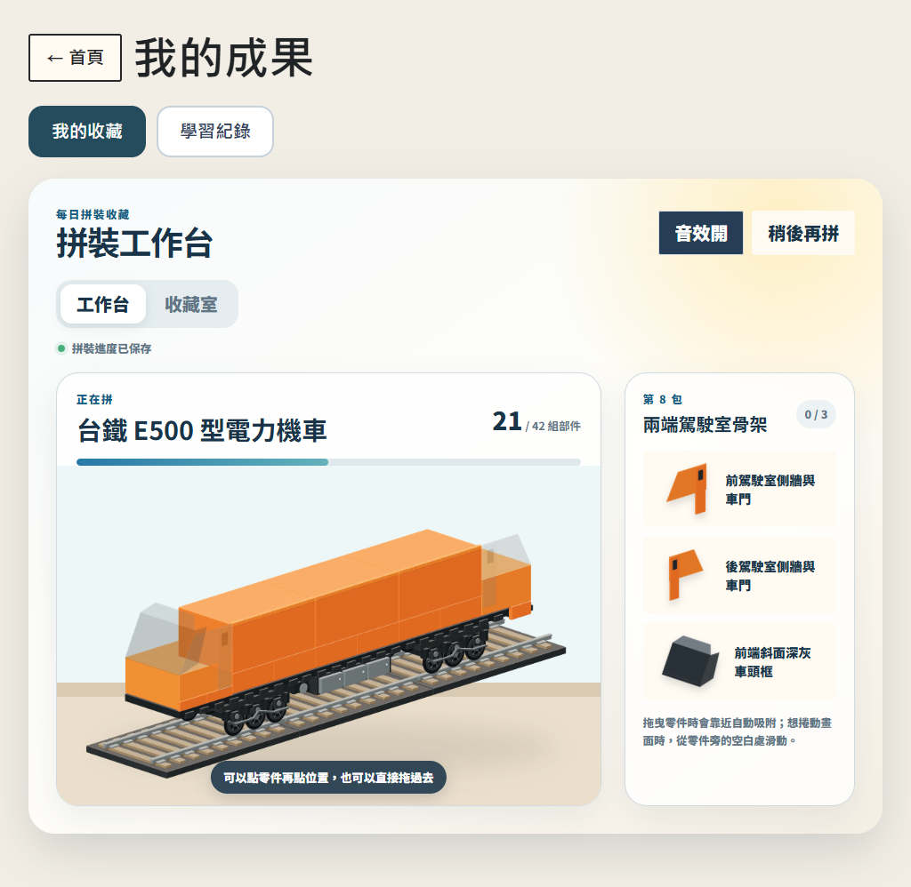
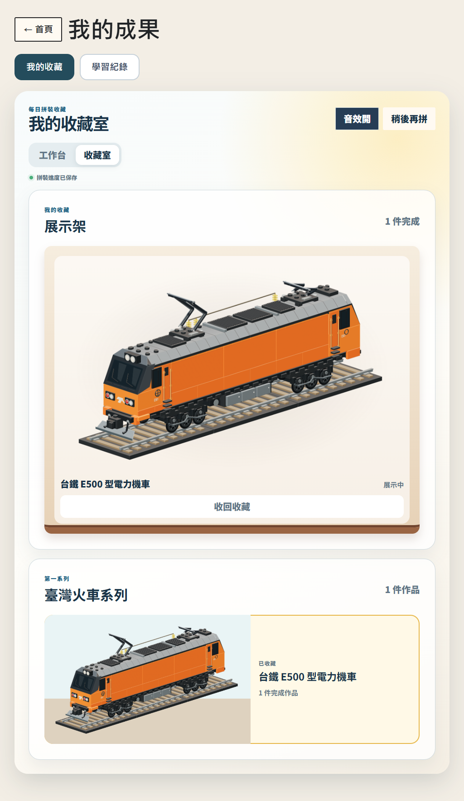

# 每日目標與拼裝收藏

主規格 [#110](https://github.com/huansbox/aiden-study/issues/110)，實作拆分為每日目標 [#111](https://github.com/huansbox/aiden-study/issues/111)、拼裝 [#112](https://github.com/huansbox/aiden-study/issues/112) 與整合驗收 [#113](https://github.com/huansbox/aiden-study/issues/113)。

## 使用方式

家長後台的「每日目標與拼裝包」設定一次活動和份量，每天按臺灣日期重新計算。題庫數學預設建議 10 題，英文建議一輪；按儲存後才生效。新增活動不會自動加進每日必做量，孩子仍自行選內容，不指定單元或複習。

完成任一目標得到第一包，全部目標完成得到第二包；一天最多兩包。只有一項時完成可同時得到兩包。沒有安排目標時，自由練習完整一輪只得到第一包。重送與當天再練都不增加第三包。數學題庫是 `study:math`、長除法是 `math`，英文拼字和 Native Camp 各自計算。

若某活動沒有可練內容，家長可取消該目標或調整份量，儲存後立即生效。當日已練進度與已領包保留；清空清單不會補發「全部完成」包。這是家長調整目標的處理路徑，系統不自行指定另一堂課。

首頁只有「我的成果」入口，內分「我的收藏／學習紀錄」。學習紀錄保留今日、累計、活動明細及八個里程碑。收藏內的工作台支援點零件再點空位、或拖曳靠近吸附；稍後再拼會保留各零件位置。收藏室同頁顯示展示架與系列內容。

第一系列改為「臺灣火車系列」，首款是台鐵 E500 型電力機車。每件需 14 包，每包三組可操作部件，共 42 組。每日兩包約七個達標日完成一件；漏日不扣除成果。每組由多顆積木組成，並非要求孩子每次只放一顆最小積木。

## E500 造型與組裝

2026-09-23 使用者確認[造型概念](e500-approved-concept.png)後授權接入實際收藏流程。依[東芝 E500 官方設計](https://www.global.toshiba/jp/design/corporate/works/16.html)與[實車照片](https://japan.focustaiwan.tw/travel/202310280003)保留橘色長車身、深灰色車頭窗框、雙端駕駛室、灰色車頂、兩組三軸轉向架與集電弓；E500 是車型，E501 是示例車號。

工作台沿用固定視角，部件本身具有頂面、側面、凸點與接縫；零件盤、拖曳部件、已放置模型與展示架共用同一組素材。42 組各自保存，不以切換整張完成度圖片替代拼裝。概念圖用於確認方向，實際素材以工作台呈現與分組驗證為準。

造型在開發時由 3D 幾何預先渲染成 42 張透明 PNG，約 1.82 MB；正式頁面只組合圖片，不載入 Three.js 或執行 WebGL。每張圖片按自身範圍裁切，保留個別拖曳與吸附位置；零件以塑膠材質、凸點及接縫表達積木感。重建方式見 [E500 圖像來源](../scripts/e500-art/README.md)。獨立部件之間的互投陰影略有簡化，這份模型也不是實體積木套件的可購買零件清單。

新版可選模型僅包含已確認的 E500；後續車型尚未加入，不用虛構待解鎖車輛或承諾推出日期。收齊目前系列後，額外拼裝包繼續保留。舊版小汽車、蒸汽火車與飛機以原 ID、原素材保留既有半成品及完成收藏，不把舊火車進度直接改成 E500；舊客戶端的已支援模型操作仍可接續。

## 保存與同步

- 既有 family activity streams、App progress 與前景計時仍使用原 KV 同步。新收藏不掃描舊累計，不回填舊插畫的擁有紀錄。
- 每個孩子一個 `ChildCollection` SQLite Durable Object，使用同步交易原子保存命令、回合證據與收藏狀態。`date:first`、`date:all` 在該孩子的物件內唯一；同包只分配一次，零件放置為集合合併。
- `collection-client.js` 使用逐命令本機 outbox。操作身分固定，回應遺失仍重送同一份內容，暫時性的儲存失敗不清掉待送命令。較舊回應不覆蓋較新 revision。
- 新作答可離線保存，連線後按原日期處理。已分配到作品的零件可離線拼；新選作品與首次分配包需連線確認。完整作品的永久完成與展示等伺服器確認，畫面不把待同步狀態說成已完成收藏。
- `family.beginRound({roundId,entryId})` 只在 App 真正開始一輪時呼叫；`record()` 即時保存，`finishRound()` 只在結果畫面完成回合。暫停、背景與重複完成不增加輪數。回合綁定原作答世代，累計重置後不能用舊回合發新包。
- 累計重置仍依 [activity-reset.md](activity-reset.md) 增加 activity generation。收藏資料不跟著重置，也不把舊活動改標為新世代。

## 實作界線與發布

部署入口改為 `worker/entry.mjs`，匯出既有 Worker 及 SQLite DO class。`worker/wrangler.jsonc` 增加 `COLLECTIONS` binding 與 SQLite migration；正式環境須先部署支援收藏的 Worker，再發布前端。Worker 尚未更新時，新前端清楚提示收藏暫時無法連線，舊練習仍可保存。

前端載入 `collection-core.js`、`collection-client.js` 後載入 family client。首頁另外載入模型、工作台及成果樣式；所有入口的版本參數與首頁 release hash 須隨變更更新。Node CI 先執行 `npm ci` 安裝隔離 runtime，Python checks 沿用 `uv`。

## 可重現驗證

```powershell
npm ci
node --test tests/*.mjs
uv run pytest -q
node tests/helpers/serve-family.mjs 8797
npx --yes agent-browser --session brick-e2e open http://127.0.0.1:8797/test/start
npx --yes agent-browser --session brick-e2e get cdp-url
node scripts/verify-collection-e2e.mjs <上一行的本機 websocket URL> http://127.0.0.1:8797
```

每次完整驗收使用新啟動的隔離服務。驗收程式只接受 loopback 測試站，清空該測試 origin 的瀏覽器儲存，再以 test-token 連線；不接觸正式家庭進度。數學題文與答案為 synthetic fixture，英文走實際拼字畫面。

完整流程先真正練習領兩包，再透過只存在測試服務的 `/test/collection-fixture` 補十二個過去日期的包，以免等待多日。剩餘零件仍逐件經畫面操作和正式收藏 API 保存。另用獨立 browser context 驗證另一台裝置、離線重開，以及維運同型的 activity generation 重置。

無內容情境使用測試服務產生的已完成 Native Camp 課程：確認瀏覽已完成內容不發包，完成另一個英文活動先取得第一包，家長取消無可練內容的目標後保留當日進度並取得第二包；重複儲存仍不超過兩包。

截圖與結果寫入 `.scratch/collection-e2e/`。自動化在 Chromium Pad 尺寸使用真實 touch input 事件；這不等於實體 iPad 或孩子手感驗收。單包 15–30 秒仍是設計目標，不能拿自動化完成秒數宣稱真人已達標。

CDP 測試的 touch drag 按畫面 frame 分送移動，完成後保留 500 ms 手勢間隔。只有靜態色塊與按鈕的獨立對照頁也會吞掉緊接合成滑動的點擊，加入此間隔後恢復；間隔只在驗收 driver，正式介面沒有因此加入固定等待。[Chromium 的 gesture configuration](https://chromium.googlesource.com/chromium/src/+/HEAD/ui/events/gesture_detection/gesture_configuration.h) 另記錄了手勢後的 tap suppression 時窗。

## 2026-09-22 驗收紀錄

- 本機 Node 全套 635 項通過；Python 268 項通過、1 項略過。
- 隔離瀏覽器從空白資料開始，14 個流程檢查全數通過：家長設定、真實數學與英文回合、兩段領包、Pad 點擊／拖曳／取消、稍後接續、收藏室切換、離線重開補送、獨立裝置接續、42 零件完成展示、generation 重置、孩子隔離、原 8 里程碑、下一件作品及無可練內容的目標調整。
- 每日目標核心、工作台與整合各有獨立唯讀審查。已採納回合世代綁定、重複分包、已完成模型重選、鍵盤焦點與首頁／元件導覽衝突等修正。
- 正式環境尚未部署；實體 iPad 與孩子操作時間尚未驗收。

## 2026-09-23 E500 實作與驗收

- Node 全套 646 項通過；本次 Python 268 項通過、1 項略過。模型測試逐張解碼 42 PNG、核對 hash／裁切範圍／網站路徑，並用畫面像素確認每次放置均有可見進展。
- 全新隔離服務跑完 [18 條 E2E 流程](e500-e2e-result.json)：從真實數學與拼字練習領包，到 E500 的 42 組拼裝、收藏展示、離線補送、跨裝置與舊蒸汽火車接續。使用 Chromium 1024×768 touch input，另驗證 768×1024 直向畫面沒有橫向溢出；輪組、車身、車頂及車鉤階段均實際拖曳。
- 用瀏覽器阻擋單張 PNG，驗證新拼裝、另一台裝置的已完成作品及收藏室均可顯示錯誤、重試並保留進度。獨立複查已確認：下一包圖片尚未載入時，半成品與最後一組的吸附動畫保留；載圖 callback 不會提早截斷動畫。
- 唯讀 review 後無未解決 P1／P2。首頁 release 與作品目錄一致性檢查通過。正式環境未合併／部署，實體 iPad 與孩子單包操作時間仍未實測。

實際工作台（已放 21／42 組）：



完成收藏與展示架：


