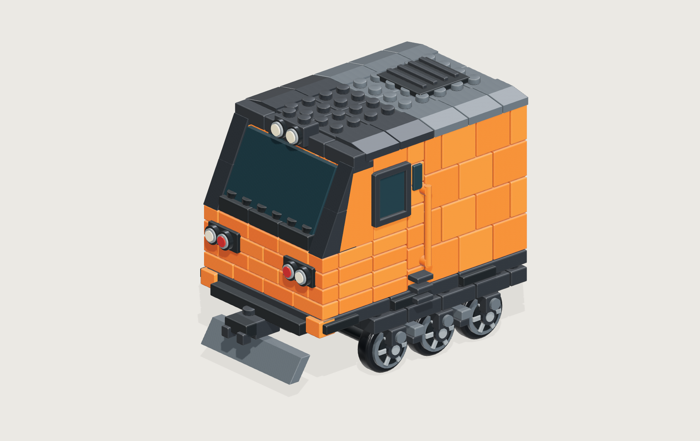
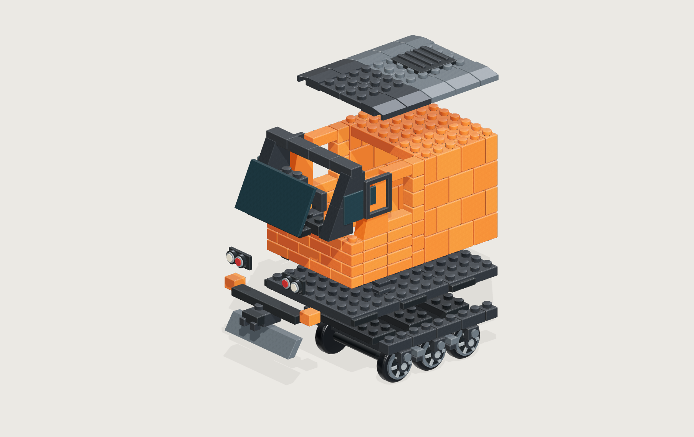

# E500 造型修正小樣

待回答的問題：車頭與一組三軸輪組，是否一眼看得出由玩具積木拼成，且仍能認出 E500？

使用者在 2026-09-23 指出原 42 張素材雖像 E500，但太接近實車模型，積木感比先前確認的概念圖弱。因此原版功能 E2E 通過不代表造型驗收通過。這次只修正車頭＋輪組，先確認零件形狀與比例，再延伸整台。

## 開啟

```sh
node scripts/e500-art/serve.mjs 8878
```

瀏覽 `http://127.0.0.1:8878/prototype.html`。這是開發用、沒有收藏資料讀寫的局部模型；不會替換正式 42 張 PNG。

- `?view=assembled`：組合外觀，可拖曳旋轉。
- `?view=exploded`：將組件拆開，確認是真正有厚度的零件。
- `?view=wheels`：只看三軸輪組。
- 頁面下方可展開先前確認的概念圖。

幾何在 `prototype-model.js`；光線、塑膠材質與預覽在 `prototype-render.js`。以一致 stud 間距、小磚堆疊、明確接縫、獨立斜坡磚、厚實輪組修正造型。這是造型小樣，拆解分組尚未映射正式 14 包／42 組。

## 決策狀態

等待使用者對實際渲染小樣的回饋。確認後將選定的零件比例與造型吸收至正式模型來源，再重建素材與驗證互動；試驗用頁面不作為正式產品入口。

第一版小樣已完成：8 組部件、16 單位 stud 間距，橘色小磚是真正獨立幾何；屋頂斜磚的底部凹槽容納車身凸點。模型組合、拆解、輪組近看、拖曳旋轉、重設視角與直向 768px 預覽均經瀏覽器確認，沒有 console error。唯讀複查未見阻擋展示的穿模、截斷或路徑問題。

以下圖片取自實際 3D 預覽，尚未代表使用者已接受造型：




